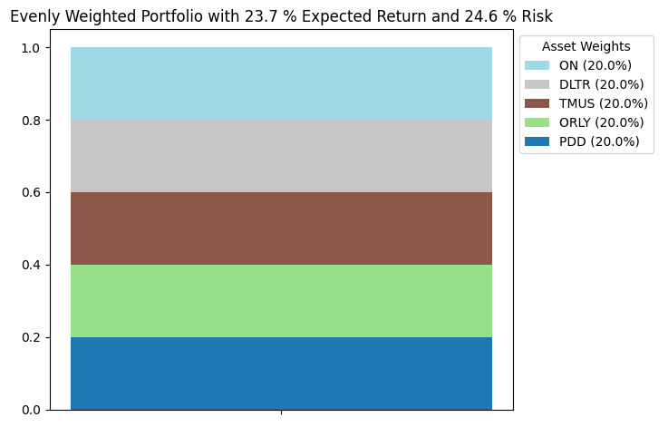
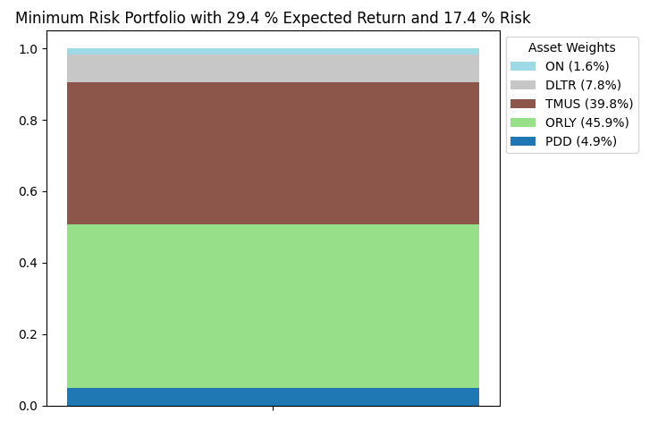
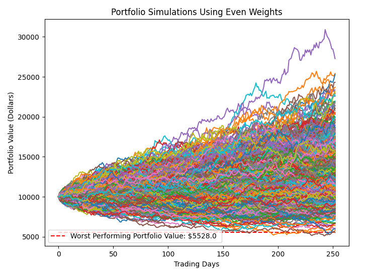
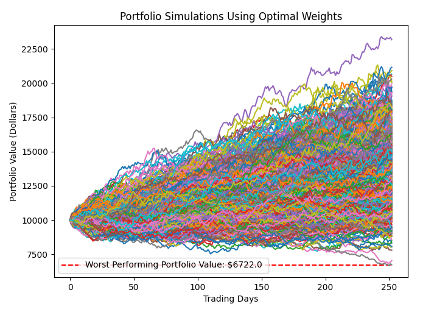
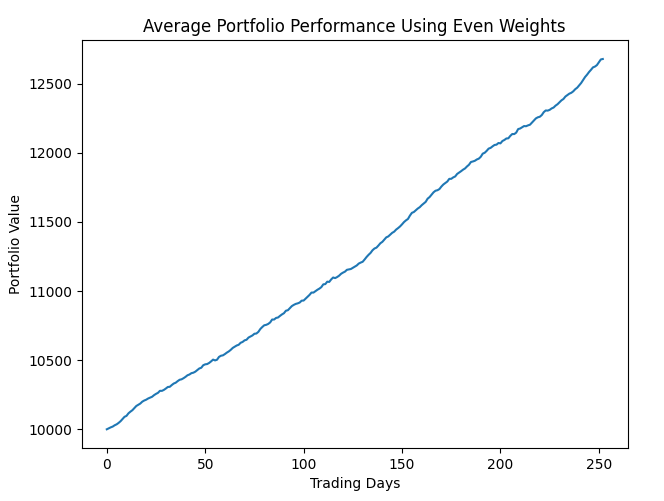
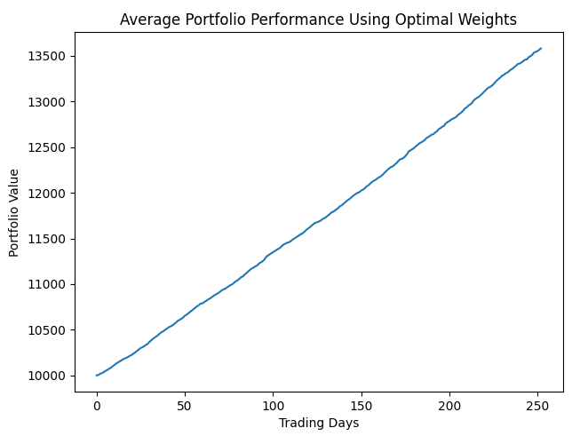
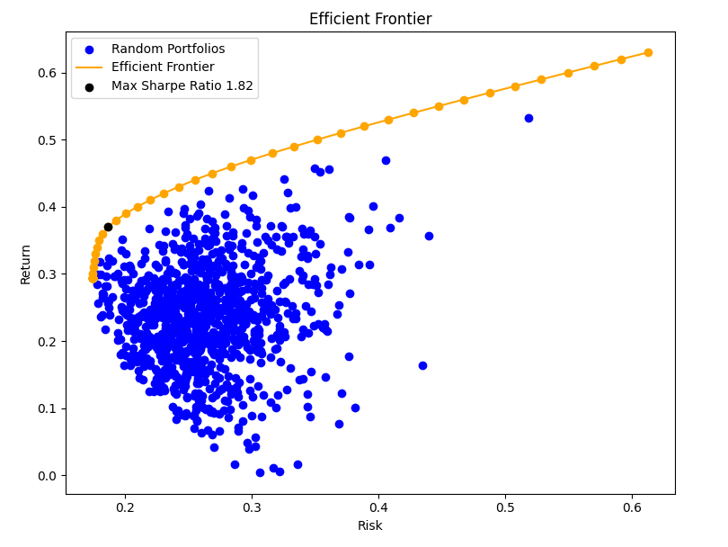
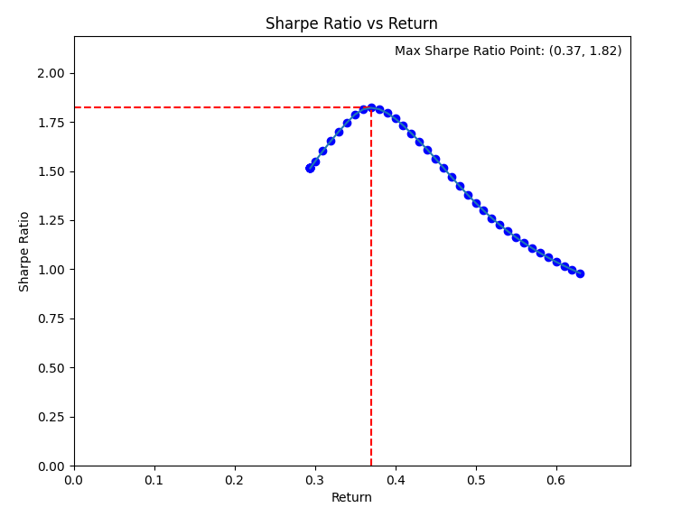
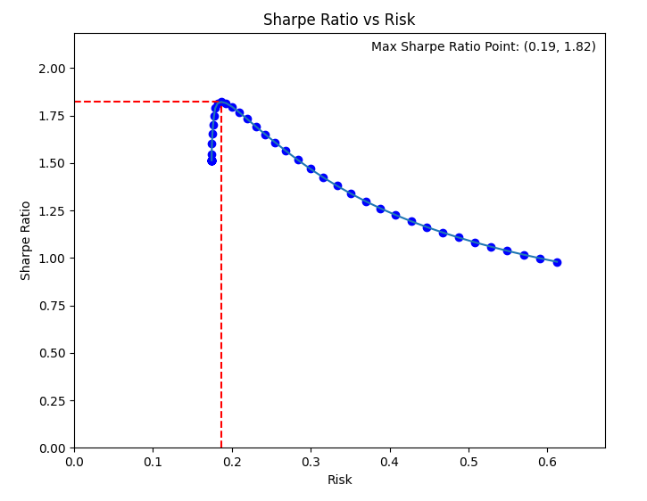

# Portfolio Optimization Using Modern Portfolio Theory

## Table of Contents
- [Overview](#overview)
- [Features](#features)
- [How to Run](#how-to-run)
- [Example](#example)
- [Theory](#theory)

## Overview
This project uses Modern Portfolio Theory and convex optimization to find the ideal asset allocations based on risk and return. The optimizer calculates the minimum-risk portfolio that meets a target expected return while visualizing key insights, such as the Efficient Frontier, portfolio performance simulations, and Sharpe Ratio behaviour.

## Features
For a selected set of assets, the project provides:

### 1. Portfolio Weight Comparisons
   * First, calculates an evenly weighted portfolio as a baseline.  
   * Then, optimizes for the lowest-risk portfolio that achieves the same (or better) expected return.  
   * Visualizes the weight distributions in a stacked bar chart and compares risk metrics.

### 2. Monte Carlo Simulations
   * Simulates thousands of possible portfolio value paths to compare the potential performance of the baseline and the optimized portfolios.
   * Used to identify realistic worst case scenarios to assess portfolio risk exposure.
   * Also calculates the average performance of the two portfolios.

### 3. Efficient Frontier Approximation
   * Computes minimum risk portfolios for a series of different rates of return and plots them on a return vs. risk graph.
   * Uses these minimum risk portfolios to interpolate and draw the efficient frontier.
   * Computes and plots a large number of randomly weighted portfolios to help visualize the meaning behind the efficient frontier.
   * Identifies the portfolio with maximum Sharpe ratio on the graph.

### 4. Sharpe Ratio Visuals
   * Computes the Sharpe ratios of the minimum risk portfolios and plots them vs. risk and vs. return.
   * Used to analyze the behaviour of the Sharpe ratio as risk and return vary.

## Requirements  
- Python 3.x  
- Dependencies:  
  - `yfinance` (Ensure package is up to date for proper api usage)  
  - `numpy`, `pandas`, `cvxpy`, `matplotlib`

## How to Run  

1. **Install dependencies:**  
   ```bash
   pip install -r requirements.txt
   ```

2. **Run the optimization script:**
   ```bash
   python3 main.py
   ```

3. **Adjust parameters as necessary:**
- To choose specific tickers, in main.py replace
   ```python
   tickers = random.sample(tickers, ASSETS)
   ```
   with

   ```python
   tickers = ["MSFT", "AAPL", "NFLX", "NVDA"] # Or whatever combination of assets you want
   ```

## Example

For this example we will use the tickers ['PDD', 'ORLY', 'TMUS', 'DLTR', 'ON'].

### 1. Portfolio Weight Comparisons

Here we can see that the evenly weighted portfolio has an expected return of 23.7% and a risk of 24.6%. The optimized minimum risk portfolio has a risk of 17.4% and a return of 29.4%. Mathematically, the expected return constraint is treated as an inequality, so cases like this where the minimum risk portfolio actually has a higher expected return than the evenly weighted portfolio can happen. Explicitly speaking, the solver found the portfolio with the lowest risk that has an expected return of at least 23.7%.




### 2. Monte Carlo Simulations

Each of these graphs plots a series of random walks using geometric Brownian Motion to simulate portfolio performance over the course of one year. These graphs simulate 1,000 scenarios with starting values of $10,000 each but that amount can easily be altered. 

The main take away from these is that the optimized portfolio has a much tighter spread than the evenly weighted portfolio. To highight this, the worst performing simulations have been identified on both graphs: The worst of the evenly weighted portfolio ends at $5528, while the worst of the minimum risk portfolios ends at $6722.




Graphs of the average of these simulations have also been included. The performance of a risk-free asset is depicted by a linear line. In this example there is not much difference due to the high number of simulations, but we can notice that the minimum risk portfolio is slightly more "linear". These visuals are more interesting in certain extreme examples where a stark difference between the lines can be observed.



   
### 3. Efficient Frontier Approximation

The Efficient Frontier is the orange line which is estimated by connecting a series of minimum risk portfolios (the orange dots) with different target returns. These are the most optimal portfolios for each level of risk or return (depending on how you want to read the graph). To help illustrate this, the blue dots are 1,000 randomly weighted portfolios. As we can see for a given return value, the portfolio with the lowest risk will always fall on the orange line. The portfolio with the maximum Sharpe ratio (ratio of excess return to risk) is also included as the black point. 


   
### 4. Sharpe Ratio Visuals

Sometimes it is useful to not just find the maximum point of measurement, but to also model the behaviour of a measurement with respect to certain parameters. Here we model how the Sharpe Ratio changes with respect to risk and return. This portfolio achieves a maximum Sharpe ratio of 1.82 when expected return is 37% and risk is 19%. We can see that the Sharpe Ratio quickly drops if we try to increase either of these parameters.




## Theory

Modern Portfolio Theory is a framework that is designed for constructing portfolios that optimize the trade of between risk and return. The centre idea is diversification, which it quantifies using the covariance matrix. The covariance matrix measures how correlated the performance of different assets are. The idea behind this is that even if you split up your capital between many different assets, if they are all strongly correlated, then your portfolio might be less diverse and more risky than it seems. Modern Portfolio Theory defines risk as the expected variance of the portfolio, which can be mathematically represented as:

`Risk = wᵀ Σ w`  
Where `w` is the vector of asset weights and `Σ` is the covariance matrix of asset returns.

`E[R] = wᵀ r`  
Where `r` is the vector of expected asset returns.

It is common for the risk averse investor to want to minimize their risk while having their expected return meet some threshold. If we call this threshold target, then we can turn this situation into the following convex optimization problem:

Minimize `wᵀ Σ w`

Subject to 

`wᵀ r ≥ target`  
`∑ wᵢ = 1` (ensures all the capital is used) 
`wᵢ ≥ 0` (prevents short selling, though this can be ignored to allow for short selling)

The Efficient Frontier, which plots the minimum-risk portfolios for each level of return, is a key outcome of this optimization problem. The portfolios that lay on the frontier are considered efficient because they represent the best trade-offs between risk and return. This project also includes Sharpe ratio calculations which quantify the ratio of excess return to risk. The portfolio with the maximum Sharpe Ratio is considered the most efficient.
